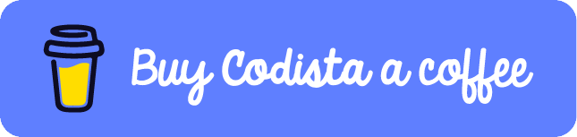
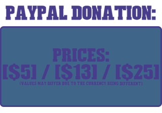

# VSCode AutoSave (AutoSave changing window added)

\_\_\_\_\_\_\_\_\_\_\_\_\_\_\_\_\_\_\_\_\_\_\_\_\_\_\_\_\_\_\_\_\_\_\_\_\_\_\_\_\_\_\_\_\_\_\_\_\_\_\_\_\_\_\_\_\_\_\_\_\_\_\_\_\_\_\_\_\_\_\_\_\_\_\_\_\_\_\_\_\_\_\_\_\_\_\_\_\_\_\_\_\_\_\_\_\_\_\_\_\_\_\_\_\_\_\_\_\_\_\_\_\_\_\_\_\_\_\_

 

</img>

</img>

Forget about CTRL + S!

Save your progress whenever the file is free of errors.

_Works best with `editor.formatOnSave: true`._

Use your time to focus on what matters: **writing quality code!**

## Demo

## Features

-   **(DONE)** AutoSave your file when there's no problem.
-   **(DONE)** Display progress notifications for saved minutes.
-   **(DONE)** Disable autoSave for specific moments (like opening a bracket)
-   **(NEXT)** Know saved time daily/weekly/monthly.
-   **(FUTURE)** AutoImport all on save.
-   **(FUTURE)** Cool metrics dashboard.

Have an interesting feature in mind? Tweet me!

